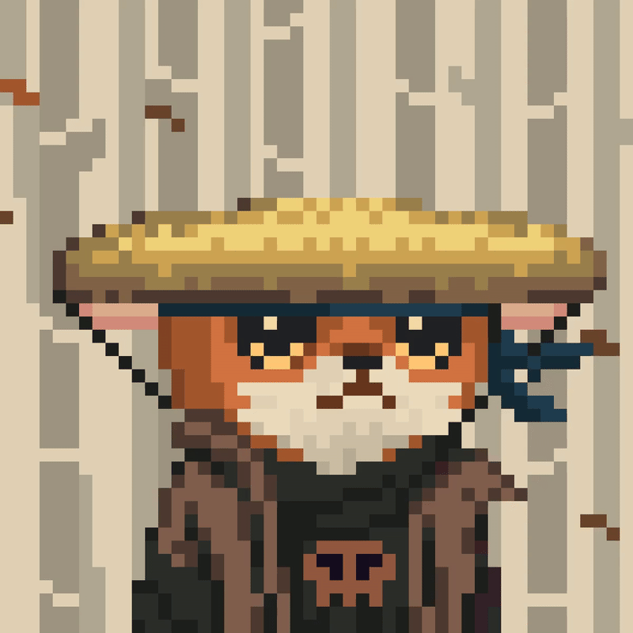

 

 

    
	
	
    
    

#### Hungry Solana dev with a decade of fullstack experience. I'm focused on building scalable, secure, and efficient applications.

## 📚 PROJECTS

Below, you'll find some of the anchor programs I've built, showcasing my skills in Solana development & deployment.

Anchor Vault

 

Simple Anchor Vault to stow away and manage $SOL on Solana.

#### Features

- Flexible, programmable access control
- Integration with Solana's ecosystem

[learn more](./1.Vault/Readme.md)

[comment]: <> (Extend Catistics)

 

Anchor Escrow

 
Simple Anchor Escrow service to make available for swaps one asset for another on Solana.

#### Key Features

- Decentralized, trustless transactions
- Secure, on-chain escrow mechanism

[learn more](./2.Escrow/Readme.md)

[comment]: <> (Extend Catistics)

Anchor Marketplace

 
A decentralized marketplace built on Solana, supporting a variety of spl tokens.

#### Key Features

- Decentralized, trustless trading
- Support for various digital assets

  [learn more](./3.Marketplace/Readme.md)

[comment]: <> (Extend Catistics)

Anchor AMM

 
A simple Anchor AMM market maker to provide a way provide liquidity for asset pairs.

#### Key Features

- Decentralized, trustless trading

  [learn more](./3.Marketplace/Readme.md)

[comment]: <> (Extend Catistics)

## 🤝 CONNECT

Feel free to reach out to me on [Discord](https://i.imgur.com/DJTajT9.png) or [Twitter](https://x.com/ScozziAxie) to discuss potential collaborations, projects, or opportunities.

## CONTRIBUTING

If you're interested in contributing to any of my projects, please submit a pull request or reach out to me directly. I'm always open to collaborating with like-minded developers! 🍻

## License

My projects are licensed under the [MIT License](link).

    <!--  -->
    
    

    

